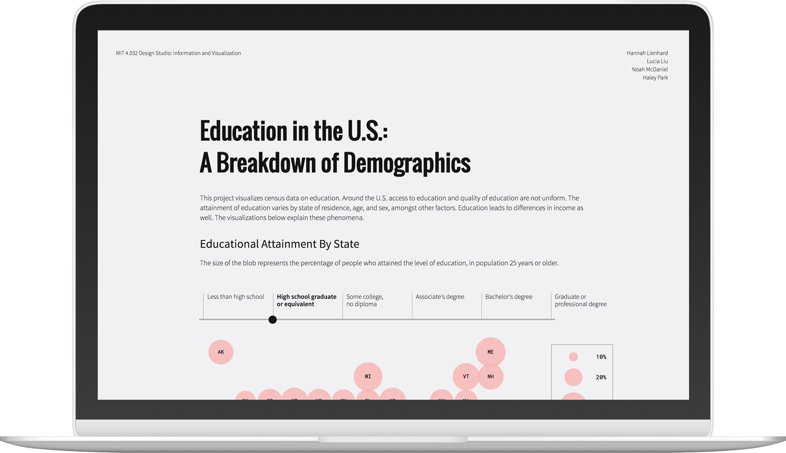

# Education in the U.S.: A Breakdown of Demographics
Team repository for MIT 4.032 Project 3 - Census Visualization

## Challenge
Students were asked to design a 2D visualization using data from the US Census.

   

   

## Links
[URL](https://haleyparkdesign.github.io/census-visualization/)

[Course website](https://irenedelatorre.github.io/MIT-Design-Studio-Information-and-Visualization/)